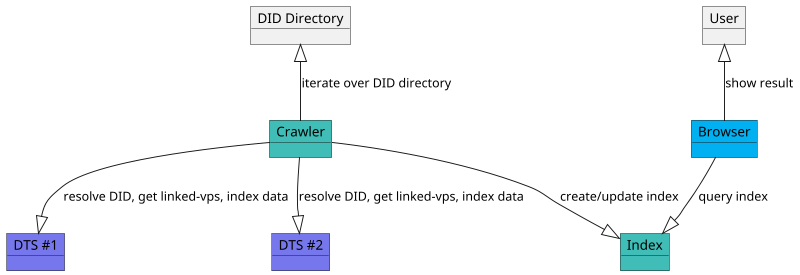

# Decentralized Trust v1.0 Specification

**Specification Status:** [Pre-Draft](https://github.com/decentralized-identity/org/blob/master/work-item-lifecycle.md)

**Latest Draft:** [2060-io/dts-specs](https://github.com/2060-io/dts-specs)

**Editors:**

~ [Fabrice Rochette](https://www.linkedin.com/in/fabricerochette) (2060.io)

<!-- -->

**Participate:**

~ [GitHub repo](https://github.com/2060-io/dts-specs)

~ [File a bug](https://github.com/2060-io/dts-specs/issues)

~ [Commit history](https://github.com/2060-io/dts-specs/commits/main)

---

## Abstract

The Internet is broken. All existing communication channels are insecure, and obsolete. Because all existing communication channels rely on public identifiers, anyone that knows your identifier can reach you.

Furthermore, existing communication channel do not provide a sure-fire way of verifying service provider and end-user Identity. This is an open door to spam, phishing, fraud, identity theft...

Regarding service providers and services, each service has it own registration process, fastidious password rules... And/or they are usually using federated login, that makes you depend on a third party service for accessing your accounts.

If the World Wide Web was initially designed for interoperability, major companies have managed to transform it to a closed, centralized internet, that we all depend on.

Not to talk about privacy, and what's done with our data.

To build a new, trustable internet, we need new, trustable communication channels, where both ends can be clearly identified, and where providing a service, accessing a service, or creating a new account, should be as simple as presenting a credential.

Decentralized Trust Services are services that are using a secure bidirectional persistent communication channel that, combined to trust layers such as [Public Trust Registries](https://github.com/2060-io/public-trust-registry-specs), enable establishing a trustable communication channel between peers.

## About this Document

In order to fully understand the concepts developed in this document, you should have some basic knowledge of [[ref:DID]], [[ref:DIDComm]], [[ref:DTS]], [[ref:trust registry]], ledger-based applications, and more generally, all terms present in the [Terminology](#terminology) section.

## Introduction

### What is a Trustable Communication Channel?

*This section is non-normative.*

A [[ref: trustable communication channel]] is a persistent communication channel, where participants have been fully authenticated with a [[ref: verifiable credential]] or equivalent.

Communication channel is considered trustable in the following use cases:

- immediately when establishing the connection for all participants. In this case, all participants must present a [[ref: verifiable credential]] to establish a connection.
- immediately when establishing the connection for some participants. If some of the participants present a [[ref: verifiable credential]] to establish a connection, and some other participants connect without authenticating themselves, only authenticated participants will be trustable in this connection. These unauthenticated participants must later on present a credential through the established connection to authenticate themselves.
- after establishing the connection, by presenting [[ref: verifiable credentials]] directly after having established the connection.

### What is a Decentralized Trust Service?

*This section is non-normative.*

A [[ref: decentralized trust service]] is a service that provide a way to identify itself *before* connecting to it. Entities that want to connect to a [[ref: decentralized trust service]] can review its presented [[ref: verifiable credentials]], prove their legitimacy by performing a [[ref: trust resolution]], and based on the result, decide to connect or not.

### Conformance

As well as sections marked as non-normative, all authoring guidelines, diagrams, examples, and notes in this specification are non-normative. Everything else in this specification is normative.
The key words MAY, MUST, MUST NOT, OPTIONAL, RECOMMENDED, REQUIRED, SHOULD, and SHOULD NOT in this document are to be interpreted as described in [BCP 14](https://datatracker.ietf.org/doc/html/bcp14) [RFC2119](https://w3c.github.io/vc-data-model/#bib-rfc2119) [RFC8174](https://w3c.github.io/vc-data-model/#bib-rfc8174) when, and only when, they appear in all capitals, as shown here.

## Terminology

[[def: account, accounts]]:
~ A [[ref: public trust registry]] account.

[[def: applicant, applicants]]:
~ A [[ref: controller]] that starts a [[ref: validation process]].

[[def: chain rest endpoint, chain rest endpoints]]:
~ The chain REST endpoints, as registered in the chain registry, like https://github.com/cosmos/chain-registry/blob/master/verana/chain.json for the Verana mainnet.

[[def: controller, controllers]]:
~ An [[ref: account]] which is the controller of a specific resource in an [[ref: PTR]].

[[def: credential schema, credential schemas]]:
~ An [[ref: PTR]] resource which represents a verifiable credential definition and the associated permissions and business rules for issuing, verifying or holding a credential linked to this credential schema.

[[def: credential schema permission, credential schema permissions, CSP]]:
~ A permission, linked to a [[ref: credential schema]], that represent a grant for being [[ref: issuer]], [[ref: verifier]], [[ref: issuer grantor]], or [[ref: verifier grantor]] of a [[ref: credential schema]].

[[def: decentralized identifier, DID, DIDs]]:
~ A decentralized identifier, as specified in [[spec-norm:DID-CORE]].

[[def: decentralized identifier communication, DIDComm]]:
~ [DIDComm](https://identity.foundation/didcomm-messaging/spec/) uses [[ref: DIDs]] to establish confidential, ongoing connections.

[[def: decentralized identifier document, DID Document, DID Documents]]:
~ A DID Document, as specified in [[spec-norm:DID-CORE]].

[[def: decentralized trust service, DTS, DTSs]]:
~ A service, usually provided using [[ref: DIDComm]], that can be deployed anywhere by its owner, and that is using the decentralized trust layer provided by an [[ref: PTR]], and has a resolvable [[ref: proof of trust]].

[[def: decentralized trust service browser, DTS browser, DTS browsers]]:
~ A browser for accessing and using [[ref: DTSs]]. To be considered as a [[ref: DTS browser]], a browser must implement an [[ref: PTR]] trust layer and use a trust resolution using use the [[ref: essential credential schemas]] for providing a [[ref: proof of trust]] to users so that user clearly identifies [[ref: DTS]] provider and decides to connect or not.

[[def: denom]]:
~ Native token of an [[ref: PTR]], example: ts.

[[def: DID Directory, DID directory]]:
~ A repository of DIDs in an PTR.

[[def: entity, entities]]:
~ An [[ref: account]], a [[ref: group]], or the [[ref: governance authority]].

[[def: essential credential schema, essential credential schemas]]:
~ Default [[ref: credential schema]], created at genesis of an [[ref: PTR]], that provide the basis for a trust layer to exist in the ecosystem so that [[ref: DTS browser]] can generate a [[ref: proof of trust]].

[[def: estimated transaction fees]]:
~ Estimated fees required, in [[ref: denom]], that is passed when execute a [[ref: transaction]] in an [[ref: PTR]]. Usually, a estimated transaction fees are always slightly greater than [[ref: transaction fees]], to make sure the execution of the transaction will not be aborted for an out-of-gas situation. Unused gas is refunded to account.

[[def: governance framework, GF]]:
~ The governance framework (GF) of an [[ref: PTR]].

[[def: governance authority, GA]]:
~ The governance authority (GA) of an [[ref: PTR]].

[[def: group]]:
~ A group.

[[def: holder, holders]]:
~ A role an entity might perform by possessing one or more verifiable credentials and generating verifiable presentations from them. A holder is often, but not always, a [[ref: subject]] of the verifiable credentials they are holding. Holders store their credentials in credential repositories. Example holders include organizations, persons, things.

[[def: issuer, issuers]]:
~ A role an entity can perform by asserting claims about one or more [[ref: subjects]], creating a verifiable credential from these claims, and transmitting the verifiable credential to a [[ref: holder]]. Example issuers include corporations, non-profit organizations, trade associations, governments, and individuals.

[[def: issuer grantor, issuer grantors]]:
~ A role an entity can perform in a credential schema by adding or revoking issuers.

[[def: keeper]]:
~ A storage map(key, value) in the ledger of an [[ref: PTR]].

[[def: linked-vp]]:
~ A presentation of a [[ref: verifiable credential]] as specified in [LINKED-VP](https://identity.foundation/linked-vp/).

[[def: participant, participants]]:
~ An entity that uses an [[ref: PTR]] and its trust layer to provide or use services.

[[def: proof of trust]]:
~ Visual representation using [[ref: essential credential schemas]] of a [[ref: trust resolution]] process of a [[ref: DTS]], for identifying the [[ref: DTS]], its owner, and the [[ref: issuer]] of the verifiable credential of its owner.

[[def: public trust registry, PTR]]:
~ a decentralized, ledger-based network, which provides: trust registry features that can be used by all its [[ref: participants]]; and a tokenized business model allows charging [[ref: participants]] for [[ref: trust fees]] that are transferred to other [[ref: participants]], or locked into [[ref: trust deposits]].

[[def: query]]:
~ A read-only action that perform some reading in an [[ref: PTR]] and returns value.

[[def: subject, subjects]]:
~ A thing about which claims are made. Example subjects include human beings, animals, things, and organization, a [[ref: DID]]...

[[def: transaction, transactions]]:
~ An action that modifies the ledger of an [[ref: PTR]] and which execution requires transaction fees.

[[def: transaction fees]]:
~ Fees required, in [[ref: denom]], to execute a [[ref: transaction]] in an [[ref: PTR]].

[[def: trust deposit, trust deposits]]:
~ A financial deposit that is used as a trust guarantee. For a given [[ref: controller]], its trust deposit is increased when running validation process (either as an [[ref: applicant]] or as a [[ref: validator]]), or when registering [[ref: DID]] in the DID directory.

[[def: trust fees]]:
~ Fees paid by an [[ref: applicant]] when running a validation process and/or when registering [[ref: DID]] in the DID directory.

[[def: trust unit, trust units]]:
~ Price, in [[ref: denom]], of one unit of trust.

[[def:trust registry, trust registries]]
~ An approved list of [[ref: issuers]] and [[ref: verifiers]] that are authorized to issue/verify certain credentials in an ecosystem.

[[def: trust resolution]]:
~ Process run by, for example a [[ref: DTS browser]], which purpose is to recursively resolve [[ref: DID]] by digging into [[ref: DID Documents]] and look for [[ref: linked-vp]] entries and their [[ref: issuer]] [[ref: DIDs]], and [trust registry](https://trustoverip.github.io/tswg-trust-registry-protocol/) entries to gather whether the service provided by the [[ref: DID]] is trustable (and legitimate), or not.

[[def: valid permission]]:
~ For a given country code, a credential schema permission, which (countries attribute is null or contain the given country code), and effective_from datetime is lower than current datetime, and (effective_until datetime is null or revoked datetime is greater than current datetime), and revoked is null.

[[def: validation process]]:
~ A process run by [[ref: applicants]] that want to, for a specific [[ref: credential schema]], be a [[ref: issuer]], be a [[ref: verifier]], or simply hold a verifiable credential linked to the [[ref: credential schema]].

[[def: validator]]:
~ A role an [[ref: entity]] performs by participating in validation processes with [[ref: applicants]] in order to register them as [[ref: issuer]], or [[ref: verifier]] of a [[ref: credential schema]], or to deliver a verifiable credential to them.

[[def: verifier, verifiers]]:
~ A role an entity performs by receiving one or more verifiable credentials, optionally inside a verifiable presentation for processing. Example verifiers include service providers.

[[def: verifier grantor, verifier grantors]]:
~ A role an [[ref: entity]] can perform in a [[ref: credential schema]] by adding or revoking verifiers.

[[def: verifiable credential, verifiable credentials]]:
~ A verifiable credential as defined in [[spec-norm:VC-DATA-MODEL]].

## Specification

### DID

[DTS-DID] A [[ref: DTS]] MUST be identified by a [[:ref DID]]. The [[:ref DID]] of a [[ref: DTS]] MUST resolve to a [[ref: DID Document]].

### DID Document

[DTS-DID-DOC-1] A [[ref: DTS]] DID Document MUST contain a [[ref: linked verifiable presentation]] of an [[ref: essential credential schema]] DTS credential. Service name MUST be "LinkedVerifiablePresentation", and service id MUST be the concatenation of the [[ref: DID]] of the [[ref: DTS]] plus `#ptr-dts-credential`. Service endpoint MUST be an URL that resolve to a [[ref: DTS credential]] as specified in [DTS-DTS-CRED-1].

[DTS-DID-DOC-2] Additionally, a [[ref: DTS]] DID Document MUST contain a [[ref: trust registry]] service entry. Service name MUST be "TrustRegistry", and service id MUST be the concatenation of the [[ref: DID]] of the [[ref: DTS]] plus `#ptr-trust-registry`. Service endpoint MUST start with one of the rest URL defined in [[ref: chain rest endpoints]]. [[ref: DTS credential]] as specified in [DTS-DTS-CRED-1].

Example:

```json
  "service": [
    {
      "id": "did:web:user-dts.gaiaid.io#ptr-dts-credential",
      "type": "LinkedVerifiablePresentation",
      "serviceEndpoint": ["https://user-dts.gaiaid.io/dts-credential-presentation.json"]
    },
    {
      "id": "did:web:user-dts.gaiaid.io#ptr-trust-registry",
      "type": "TrustRegistry",
      "serviceEndpoint": ["https://{$chain-rest-api}/{$essential-schema-issuer.trust-registry-did}/trqp-2.0/"]
    }
  ]
```

### DTS Credential

[DTS-DTS-CRED-1] A DTS credential MUST contain the following mandatory attributes.

- `did` (string) (*mandatory*): the [[ref: DID]] of the DTS the credential has been issued to, which is the subject of the [[ref: verifiable credential]].
- `service_name` (string) (*mandatory*): DTS name. UTF8 charset, max length: 512 bytes.
- `service_description` (string) (*mandatory*): DTS description. UTF8 charset, max length: 2048 bytes.
- `service_logo` (image) (*mandatory*): the logo of the DTS, as it will be shown in browsers and search engines.
- `minimum_age_required` (integer) (*mandatory*): minimum required age to connect to service. Allowed value: 0 to 255. Used by browsers that provide a simple birth date based parental control.
- `terms_and_conditions` (string) (*mandatory*): URL of the terms and conditions of the DTS. It is recommended to store terms and conditions in a file, in a repository that allows file hash verification (IPFS).
- `terms_and_conditions_hash` (string) (*optional*): If terms and conditions of the DTS are stored in a file, optional hash of the file for data integrity verification.
- `privacy_policy` (string) (*mandatory*): URL of the terms and conditions of the DTS. MAY be the same URL that `terms_and_conditions` if file are combined. It is recommended to store privacy policy in a file repository that allows file hash verification (IPFS).
- `privacy_policy_hash` (string) (*optional*): If privacy policy of the DTS are stored in a file, optional hash of the file for data integrity verification.

:::todo Todo
Define if logo must be a URL or an embedded picture. I'm more into an embedded picture. Let's discuss it!
:::

[DTS-DTS-CRED-2] The DTS credential [[ref:issuer]] of the [[ref: verifiable credential]] MUST be a [[ref:DID]] that resolves to a [[ref: DTS]]. Issuer CAN be the same [[ref: DTS]] [[ref:DID]].

[DTS-DTS-CRED-3] DTS Credential MUST include a reference to a DTS Credential Schema and the DTS Credential Schema must be located in a [[ref: verifiable data registry]]. Schema MUST be defined as an official [[ref: essential credential schema] of the [[ref: trust registry]].

```json
{
  "@context": [
    "https://www.w3.org/ns/credentials/v2",
    "https://www.w3.org/ns/credentials/examples/v2"
  ],
  "id": "https://bar.example.com/dts-presentation.json",
  "type": ["VerifiableCredential"],
  "issuer": "did:foobar:456",
  "credentialSubject": {
    "id": "did:example:123",
    ...
  },
  ...
  "credentialSchema": [{
    "id": "https://example.ptr/cs/get/d84c02d5-7013-459a-8d02-09bf8e9a83bd",
    "type": "JsonSchema",
    "digestSRI": "sha384-S57yQDg1MTzF56Oi9DbSQ14u7jBy0RDdx0YbeV7shwhCS88G8SCXeFq82PafhCrW"
  }]
}
```

:::note Note
Browsers or DTSs that connect to DTSs are responsible for defining their whitelist of [[ref:trust registries]] and [[ref: public trust registries]].
:::

### DTS Credential Issuer

[DTS-DTS-CRED-ISSUER-1] The [[ref: DTS]] of a DTS Credential Issuer MUST contain a [[ref: linked verifiable presentation]] of an [[ref: organization credential]] or a [[ref: person credential]].

Service name MUST be "LinkedVerifiablePresentation", and service id MUST be the concatenation of the [[ref: DID]] plus `#ptr-org` or `#ptr-person`. Service endpoint MUST be an URL that resolve to an Organization or Person credential which subject attribute `did` is the [[ref: DID]] of the DTS. If the linked presentation is an [[ref: organization credential]], all attributes MUST be presented. If it is a [[ref: person credential]], only the `person_name` and `country_code_of_residence` MUST be present.

Example:

```json
"service": [
    {
      "id": "did:example:123#ptr-org",
      "type": "LinkedVerifiablePresentation",
      "serviceEndpoint": ["https://bar.example.com/organization.jsonld"]
    }
  ]
```

### Organization Credential

[DTS-ORG-CRED-1] An [[ref: organization credential]] MUST contain the following mandatory attributes.

- `did` (string) (*mandatory*): the [[ref: DID]] of the DTS the credential has been issued to, which is the subject of the [[ref: verifiable credential]].
- `org_name` (string) (*mandatory*): name of the organization.
- `org_registry_id` (string) (*mandatory*): registry id of the organization.
- `org_address` (string) (*mandatory*): address of the organization.
- `org_logo` (image) (*mandatory*): the logo of the organization, as it will be shown in browsers and search engines.
- `org_type` (enum) (*mandatory*): type of organization. PUBLIC, PRIVATE, FOUNDATION.
- `country_code` (string) (*mandatory*): country where the company is registered.

:::todo Todo
Define if logo must be a URL or an embedded picture. I'm more into an embedded picture. Let's discuss it.
Define if more attributes are needed here
:::

:::todo Todo
In the future, we could add a credential for proof-of-brand-registration, to avoid issues with logos.
:::

[DTS-ORG-CRED-2] Organization Credential issuer MUST include a reference to an Organization Credential Schema and the Organization Credential Schema must be located in a [[ref: public trust registry]]. Schema MUST be defined as an official [[ref: essential credential schema] of the [[ref: public trust registry]].

[DTS-ORG-CRED-3] DID Document resolved from the [[ref:DID]] of the organization credential issuer must include a trust registry service entry that points to a [[ref: trust registry]] and proves issuer was allowed to issue this credential.

### Person Credential

[DTS-PERSON-CRED-1] An [[ref: person credential]] MUST contain the following mandatory attributes.

- `did` (string) (*mandatory*): the [[ref: DID]] of the DTS the credential has been issued to, which is the subject of the [[ref: verifiable credential]].
- `first_name` (string) (*mandatory*): first name of the person.
- `last_name` (string) (*mandatory*): last name of the person.
- `birth_date` (string) (*mandatory*): date of birth.
- `country_of_birth` (string): the country of residence.

:::todo Todo
In the future, we could add an avatar credential, so that a social channel DTS provider would be identified by 2 linked-vp credentials: a person credential presentation, AND an avatar credential presentation.
:::

[DTS-PERSON-CRED-2] Person Credential issuer MUST include a reference to an Person Credential Schema and the Person Credential Schema must be located in a [[ref: public trust registry]]. Schema MUST be defined as an official [[ref: essential credential schema] of the [[ref: public trust registry]].

[DTS-PERSON-CRED-3] DID Document resolved from the [[ref:DID]] of the person credential issuer must include a trust registry service entry that points to a [[ref: public trust registry]] and proves issuer was allowed to issue this credential.

### DTS Trust Resolution

The trust resolution is a mechanism that verifies a [[ref: DID]] is resolvable, and complies with the Decentralized Trust Service Specification.

Before attempting to connect to any service endpoint provided present in the DID Document, an entity MUST perform a trust resolution and the trust resolution SHOULD be successful.

This does not apply for services of type "LinkedVerifiablePresentation" or "TrustRegistry", as they are precisely needed for trust resolution so they CAN be consumed before establishing trust.

It's up to the entity to decide to connect or not to an non trustable service. Nevertheless, [[ref: browsers]] SHOULD give the option of connecting to a service only if it is trustable.

To perform a [[ref: trust resolution]] of `did:example:123`, entity MUST perform the following:

- resolve the [[ref: DID]].
- parse the DID document and find a service of type `LinkedVerifiablePresentation` entry with id `did:example:123#ptr-dts`

```json
{
  "@context": ["https://www.w3.org/ns/did/v1", "https://identity.foundation/linked-vp/contexts/v1"],
  "id": "did:example:123",
  "verificationMethod": [
    {
      "id": "did:example:123#_Qq0UL2Fq651Q0Fjd6TvnYE-faHiOpRlPVQcY_-tA4A",
      "type": "JsonWebKey2020",
      "controller": "did:example:123",
      "publicKeyJwk": {
        "kty": "OKP",
        "crv": "Ed25519",
        "x": "VCpo2LMLhn6iWku8MKvSLg2ZAoC-nlOyPVQaO3FxVeQ"
      }
    }
  ],
  "service": [
    {
      "id": "did:example:123#ptr-dts",
      "type": "LinkedVerifiablePresentation",
      "serviceEndpoint": ["https://bar.example.com/dts-presentation.json"]
    }
  ]
}
```

- parse the verifiable presentation to get DTS information, and get the [[ref: issuer]] [[ref:DID]]. We will call it **DTS credential issuer**.
- resolve the [[ref: DID]] of the DTS credential issuer, let's call it `did:dtscred-issuer:456`. In the "service" section look for a service of type `LinkedVerifiablePresentation` entry with id `did:dtscred-issuer456#ptr-org` or `did:dtscred-issuer:456#ptr-person`, and use the service endpoint to get the credential.
- look for a credential schema entry, and call the endpoint to get the credential schema. Verify it is an essential schema in a trusted public trust registry.
- resolve the [[ref: DID]] of the the Organization or Person credential issuer, let's call it `did:idcred-issuer:789`. In the "service" section look for a service of type `TrustRegistry` entry with id `did:dtscred-issuer:789#ptr-org` or `did:dtscred-issuer:789#ptr-person`, and use the service endpoint to verify issuer was allowed to issue the credential at the time it was issued.

Trust resolution MUST complete successfully for a service to be referenced as a [[ref: DTS]].

### Presentation Request Trust Resolution

When a presentation request is received within an established DIDComm connection with a DTS, or when connecting to a received out-of-band presentation request, entity MUST:

- verify the [[ref:DTS]] is resolvable;
- verify the [[ref:DTS]] [[ref:DID]] is registered in the trust registry as a verifier for the credential requested in the presentation request.

If any of these 2 verifications fail, presentation request should be refused.

### Crawlers

*This section is non normative.*

Crawlers will query the `/did-directory/list` method of [[ref: PTRs]] to get the [[ref: DIDs]] of registered [[ref:DTSs]] and resolve them to build an index by recursively resolving all linked data.

For more information, please refer to the [public-trust-registry-specs](https://github.com/2060-io/public-trust-registry-specs).



### Browser Display of Trust Resolution

#### Credential Wallets

#### Connection Invitation

#### Presentation Request

### Internationalization

It is the responsibility of browsers and search engines to properly translate credential attributes, as credential schemas are always defined in a single language, that SHOULD be english.


### Explain

- DID document of DTS must contain a "LinkedVerifiablePresentation" service entry that point to a DTS Credential.
- DID document of DTS must contain a "TrustRegistry" service entry that point to Verana URL of TrustRegistry entity in verana that is the owner.

```json
{
  "@context": ["https://www.w3.org/ns/did/v1", 
  "https://identity.foundation/linked-vp/contexts/v1",
  "https://trustregistry"
  ],
  "id": "did:web:user-dts.gaiaid.io",
  "verificationMethod": [
    {
      "id": "did:web:user-dts.gaiaid.io#_Qq0UL2Fq651Q0Fjd6TvnYE-faHiOpRlPVQcY_-tA4A",
      "type": "JsonWebKey2020",
      "controller": "did:web:user-dts.gaiaid.io",
      "publicKeyJwk": {
        "kty": "OKP",
        "crv": "Ed25519",
        "x": "VCpo2LMLhn6iWku8MKvSLg2ZAoC-nlOyPVQaO3FxVeQ"
      }
    }
  ],
  "service": [
    {
      "id": "did:web:user-dts.gaiaid.io#ptr-dts",
      "type": "LinkedVerifiablePresentation",
      "serviceEndpoint": ["https://user-dts.gaiaid.io/dts-presentation.json"]
    },
    {
      "id": "did:web:user-dts.gaiaid.io#ptr",
      "type": "TrustRegistry",
      "serviceEndpoint": ["https://verana.network/trqp-2.0/did:web:verana.foundation/"]
    }
  ]
}
```

```json

{
  "@context": ["https://www.w3.org/2018/credentials/v1"],
  "holder": "did:web:user-dts.gaiaid.io",
  "type": ["VerifiablePresentation"],
  "verifiableCredential": [
    {
      "@context": [
        "https://www.w3.org/2018/credentials/v1",
        {
          "schema": "https://schema.org/"
        }
      ],
      "issuer": "did:web:org.gaiaid.io",
      "issuanceDate": "2024-02-08T18:38:46+01:00",
      "expirationDate": "2029-02-08T18:38:46+01:00",
      "type": ["VerifiableCredential", "VeranaOrganization"],
      "credentialSubject": {
        "id": "did:web:user-dts.gaiaid.io",
        "orgName": "GaiaID LLC"
      },
      "credentialSchema": {
        "id": "https://verana.network/cs/get/d84c02d5-7013-459a-8d02-09bf8e9a83bd",
        "type": "JsonSchemaCredential"
      }
      "proof": {
        "type": "Ed25519Signature2018",
        "created": "2024-02-08T17:38:46Z",
        "verificationMethod": "did:web:org.gaiaid.io#_Qq0UL2Fq651Q0Fjd6TvnYE-faHiOpRlPVQcY_-tA4A",
        "proofPurpose": "assertionMethod",
        "jws": "eyJhbGciOiJFZERTQSIsImI2NCI6ZmFsc2UsImNyaXQiOlsiYjY0Il19..qD1a-op-GWkvzI5LaAXqJhJv-9WCSTgtEUzUvDeuiaUSDWpVUh14x5TUbGNvmx1xZ0fEf5eWZWoJ-2dogDpmBQ"
      }
    }
  ],
  "id": "https://user-dts.gaiaid.io/dts-presentation.json",
  "proof": {
    "type": "Ed25519Signature2018",
    "created": "2024-02-08T17:38:46Z",
    "verificationMethod": "did:web:user-dts.gaiaid.io#_Qq0UL2Fq651Q0Fjd6TvnYE-faHiOpRlPVQcY_-tA4A",
    "proofPurpose": "assertionMethod",
    "jws": "eyJhbGciOiJFZERTQSIsImI2NCI6ZmFsc2UsImNyaXQiOlsiYjY0Il19..6_k6Dbgug-XvksZvDVi9UxUTAmQ0J76pjdrQyNaQL7eVMmP_SUPZCqso6EN3aEKFSsJrjDJoPJa9rBK99mXvDw"
  }
}

```


### Simple Example

- Let's define a DTS with its DID did:web:user-dts.gaiaid.io.
- Let's define a Trust registry of the Verana Foundation with TRQP 2.0 URL: https://verana.network/did:web:verana.foundation/trqp-2.0/
- Let's define a Schema from the Verana foundation, the DTS Credential Schema, with UUID d84c02d5-7013-459a-8d02-09bf8e9a83bd, identified with DID did:web:verana.foundation/cs/d84c02d5-7013-459a-8d02-09bf8e9a83bd

- To prove did:web:user-dts.gaiaid.io is an authorized issuer of did:web:verana.foundation/cs/d84c02d5-7013-459a-8d02-09bf8e9a83bd, one need to call the TRQP 2.0 method:

GET https://verana.network/did:web:verana.foundation/trqp-2.0/entities/{entityVID}/authorization?{authorizationVID}

with:

- entityVID: did:web:user-dts.gaiaid.io
- authorizationVID: did:web:verana.foundation/cs/d84c02d5-7013-459a-8d02-09bf8e9a83bd

Method will return authorization if exists, based on CredentialSchema with id d84c02d5-7013-459a-8d02-09bf8e9a83bd and CredentialSchemaPerms.

#### DIDDoc of did:web:user-dts.gaiaid.io will be:


```json
{
  "@context": ["https://www.w3.org/ns/did/v1", 
  "https://identity.foundation/linked-vp/contexts/v1",
  "https://trustregistry"
  ],
  "id": "did:web:user-dts.gaiaid.io",
  "verificationMethod": [
    {
      "id": "did:web:user-dts.gaiaid.io#_Qq0UL2Fq651Q0Fjd6TvnYE-faHiOpRlPVQcY_-tA4A",
      "type": "JsonWebKey2020",
      "controller": "did:web:user-dts.gaiaid.io",
      "publicKeyJwk": {
        "kty": "OKP",
        "crv": "Ed25519",
        "x": "VCpo2LMLhn6iWku8MKvSLg2ZAoC-nlOyPVQaO3FxVeQ"
      }
    }
  ],
  "service": [
    {
      "id": "did:web:user-dts.gaiaid.io#verana-foundation-dts-credential",
      "type": "LinkedVerifiablePresentation",
      "serviceEndpoint": ["https://user-dts.gaiaid.io/dts-credential-presentation.json"]
    },
    {
      "id": "did:web:user-dts.gaiaid.io#verana-foundation-trust-registry",
      "type": "TrustRegistry",
      "serviceEndpoint": ["https://api.verana.network/did:web:verana.foundation/trqp-2.0/"]
    }
  ]
}
```

#### Verifiable presentation of the DTS Credential will be:

```json

{
  "@context": ["https://www.w3.org/ns/credentials/v2"],
  "holder": "did:web:user-dts.gaiaid.io",
  "type": ["VerifiablePresentation"],
  "verifiableCredential": [
    {
      "@context": [
        "https://www.w3.org/ns/credentials/v2"
      ],
      "issuer": "did:web:user-dts.gaiaid.io",
      "issuanceDate": "2024-02-08T18:38:46+01:00",
      "expirationDate": "2029-02-08T18:38:46+01:00",
      "type": ["VerifiableCredential"],
      "credentialSubject": {
        "id": "did:web:user-dts.gaiaid.io",
        "service_name": "GaiaID Service"
      },
      "credentialSchema": {
        "id": "https://verana.foundation/credentials/dts-credential-schema-credential",
        "type": "JsonSchemaCredential"
      }
      "proof": {
        "type": "Ed25519Signature2018",
        "created": "2024-02-08T17:38:46Z",
        "verificationMethod": "did:web:user-dts.gaiaid.io#_Qq0UL2Fq651Q0Fjd6TvnYE-faHiOpRlPVQcY_-tA4A",
        "proofPurpose": "assertionMethod",
        "jws": "eyJhbGciOiJFZERTQSIsImI2NCI6ZmFsc2UsImNyaXQiOlsiYjY0Il19..qD1a-op-GWkvzI5LaAXqJhJv-9WCSTgtEUzUvDeuiaUSDWpVUh14x5TUbGNvmx1xZ0fEf5eWZWoJ-2dogDpmBQ"
      }
    }
  ],
  "id": "https://user-dts.gaiaid.io/dts-credential-presentation.json",
  "proof": {
    "type": "Ed25519Signature2018",
    "created": "2024-02-08T17:38:46Z",
    "verificationMethod": "did:web:user-dts.gaiaid.io#_Qq0UL2Fq651Q0Fjd6TvnYE-faHiOpRlPVQcY_-tA4A",
    "proofPurpose": "assertionMethod",
    "jws": "eyJhbGciOiJFZERTQSIsImI2NCI6ZmFsc2UsImNyaXQiOlsiYjY0Il19..6_k6Dbgug-XvksZvDVi9UxUTAmQ0J76pjdrQyNaQL7eVMmP_SUPZCqso6EN3aEKFSsJrjDJoPJa9rBK99mXvDw"
  }
}

```

Upon dereferencing the value of the id https://verana.foundation/credentials/dts-credential-schema-credential, a process also be referred to as schema resolution, the following verifiable credential, representing a JSON Schema, is returned:

The JsonSchema Credential must have been issued by did:web:verana.foundation.

```json

{
  "@context": [
      "https://www.w3.org/ns/credentials/v2"
  ],
  "id": "https://verana.foundation/credentials/dts-credential-schema-credential",
  "type": ["VerifiableCredential", "JsonSchemaCredential"],
  "issuer": "did:web:verana.foundation",
  "issuanceDate": "2024-01-01T19:23:24Z", 
  "credentialSchema": {
    "id": "https://verana.network/did:web:verana.foundation/cs/d84c02d5-7013-459a-8d02-09bf8e9a83bd/jsonschema",
    "type": "JsonSchema",
    "digestSRI": "sha384-S57yQDg1MTzF56Oi9DbSQ14u7jBy0RDdx0YbeV7shwhCS88G8SCXeFq82PafhCrW"
  },
  "credentialSubject": {
    "id": "did:web:verana.foundation/cs/d84c02d5-7013-459a-8d02-09bf8e9a83bd",
    "type": "JsonSchema",
    "jsonSchema": {
       "$id": "did:web:verana.foundation/cs/d84c02d5-7013-459a-8d02-09bf8e9a83bd",
       "$schema": "https://json-schema.org/draft/2020-12/schema",
       "title": "VeranaDtsSchemaCredential",
       "description": "EmailCredential using JsonSchemaCredential",
       "type": "object",
       "properties": {
         "credentialSubject": {
           "type": "object",
           "properties": {
             "id": {
               "type": "string"
             },
            "service_name": {
              "type": "string"
            }
           },
           "required": ["id", "service_name"]
         }
       }
    }
  }
}

```