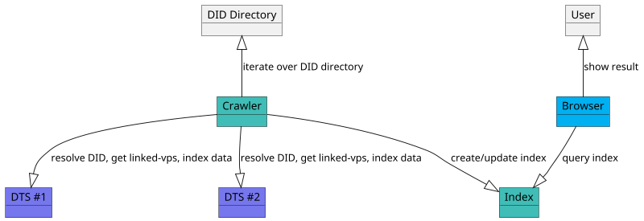

# Decentralized Trust Service v1.0 Specification

**Specification Status:** [Pre-Draft](https://github.com/decentralized-identity/org/blob/master/work-item-lifecycle.md)

**Latest Draft:** [2060-io/dts-specs](https://github.com/2060-io/dts-specs)

**Editors:**

~ [Fabrice Rochette](https://www.linkedin.com/in/fabricerochette) (2060.io)

<!-- -->

**Participate:**

~ [GitHub repo](https://github.com/2060-io/dts-specs)

~ [File a bug](https://github.com/2060-io/dts-specs/issues)

~ [Commit history](https://github.com/2060-io/dts-specs/commits/main)

---

## Abstract

The Internet is broken. All existing communication channels are insecure, and obsolete. Because all existing communication channels rely on public identifiers, anyone that knows your identifier can reach you.

Furthermore, existing communication channel do not provide a sure-fire way of verifying service provider and end-user Identity. This is an open door to spam, phishing, fraud, identity theft...

Regarding service providers and services, each service has it own registration process, fastidious password rules... And/or they are usually using federated login, that makes you depend on a third party service for accessing your accounts.

If the World Wide Web was initially designed for interoperability, major companies have managed to transform it to a closed, centralized internet, that we all depend on.

Not to talk about privacy, and what's done with our data.

To build a new, trustable internet, we need new, trustable communication channels, where both ends can be clearly identified, and where providing a service, accessing a service, or creating a new account, should be as simple as presenting a credential.

Decentralized Trust Services are services that are using a secure bidirectional persistent communication channel that, combined to trust layers such as [Public Trust Registries](https://github.com/2060-io/public-trust-registry-specs), enable establishing a trustable communication channel between peers.

## About this Document

In order to fully understand the concepts developed in this document, you should have some basic knowledge of [[ref:DID]], [[ref:DIDComm]], [[ref:DTS]], [[ref:trust registry]], ledger-based applications, and more generally, all terms present in the [Terminology](#terminology) section.

## Introduction

### What is a Trustable Communication Channel?

*This section is non-normative.*

A trustable communication channel is a persistent communication channel, where participants have been fully authenticated with a [[ref: verifiable credential]] or equivalent.

Communication channel is considered trustable in the following use cases:

- immediately when establishing the connection for all participants. In this case, all participants must present a [[ref: verifiable credential]] to establish a connection.
- immediately when establishing the connection for some participants. If some of the participants present a [[ref: verifiable credential]] to establish a connection, and some other participants connect without authenticating themselves, only authenticated participants will be trustable in this connection. These unauthenticated participants must later on present a credential through the established connection to authenticate themselves.
- after establishing the connection, by presenting [[ref: verifiable credentials]] directly after having established the connection.

### What is a Decentralized Trust Service?

*This section is non-normative.*

A [[ref: decentralized trust service]] is a service that provide a way to identify itself *before* connecting to it. Entities that want to connect to a [[ref: decentralized trust service]] can review its presented [[ref: verifiable credentials]], prove their legitimacy by performing a [[ref: trust resolution]], and based on the result, decide to connect or not.

Additionally, a [[ref: decentralized trust service]] that would like to issue or request verification of credentials must prove it is allowed to do so.

### Conformance

As well as sections marked as non-normative, all authoring guidelines, diagrams, examples, and notes in this specification are non-normative. Everything else in this specification is normative.
The key words MAY, MUST, MUST NOT, OPTIONAL, RECOMMENDED, REQUIRED, SHOULD, and SHOULD NOT in this document are to be interpreted as described in [BCP 14](https://datatracker.ietf.org/doc/html/bcp14) [RFC2119](https://w3c.github.io/vc-data-model/#bib-rfc2119) [RFC8174](https://w3c.github.io/vc-data-model/#bib-rfc8174) when, and only when, they appear in all capitals, as shown here.

## Terminology

[[def: account, accounts]]:
~ A [[ref: public trust registry]] account.

[[def: applicant, applicants]]:
~ A [[ref: controller]] that starts a [[ref: validation process]].

[[def: controller, controllers]]:
~ An [[ref: account]] which is the controller of a specific resource in an [[ref: PTR]].

[[def: credential schema, credential schemas]]:
~ An [[ref: PTR]] resource which represents a verifiable credential definition and the associated permissions and business rules for issuing, verifying or holding a credential linked to this credential schema.

[[def: decentralized identifier, DID, DIDs]]:
~ A decentralized identifier, as specified in [[spec-norm:DID-CORE]].

[[def: decentralized identifier communication, DIDComm]]:
~ [DIDComm](https://identity.foundation/didcomm-messaging/spec/) uses [[ref: DIDs]] to establish confidential, ongoing connections.

[[def: decentralized identifier document, DID Document, DID Documents]]:
~ A DID Document, as specified in [[spec-norm:DID-CORE]].

[[def: decentralized trust service, DTS, DTSs]]:
~ A service, usually provided using [[ref: DIDComm]], that can be deployed anywhere by its owner, and that is using the decentralized trust layer provided by an [[ref: PTR]], and has a resolvable [[ref: proof of trust]].

[[def: decentralized trust service browser, DTS browser, DTS browsers]]:
~ A browser for accessing and using [[ref: DTSs]]. To be considered as a [[ref: DTS browser]], a browser must implement an [[ref: PTR]] trust layer and use a trust resolution using use the [[ref: essential credential schemas]] for providing a [[ref: proof of trust]] to users so that user clearly identifies [[ref: DTS]] provider and decides to connect or not.

[[def: DID Directory, DID directory]]:
~ A repository of DIDs in an PTR.

[[def: essential credential schema, essential credential schemas]]:
~ Default [[ref: credential schema]], created at genesis of an [[ref: PTR]], that provide the basis for a trust layer to exist in the ecosystem so that [[ref: DTS browser]] can generate a [[ref: proof of trust]].

[[def: holder, holders]]:
~ A role an entity might perform by possessing one or more verifiable credentials and generating verifiable presentations from them. A holder is often, but not always, a [[ref: subject]] of the verifiable credentials they are holding. Holders store their credentials in credential repositories. Example holders include organizations, persons, things.

[[def: issuer, issuers]]:
~ A role an entity can perform by asserting claims about one or more [[ref: subjects]], creating a verifiable credential from these claims, and transmitting the verifiable credential to a [[ref: holder]]. Example issuers include corporations, non-profit organizations, trade associations, governments, and individuals.

[[def: linked-vp]]:
~ A presentation of a [[ref: verifiable credential]] as specified in [LINKED-VP](https://identity.foundation/linked-vp/).

[[def: participant, participants]]:
~ An entity that uses an [[ref: PTR]] and its trust layer to provide or use services.

[[def: proof of trust]]:
~ Visual representation using [[ref: essential credential schemas]] of a [[ref: trust resolution]] process of a [[ref: DTS]], for identifying the [[ref: DTS]], its owner, and the [[ref: issuer]] of the verifiable credential of its owner.

[[def: public trust registry, PTR]]:
~ a decentralized, ledger-based network, which provides: trust registry features that can be used by all its [[ref: participants]]; and a tokenized business model allows charging [[ref: participants]] for trust fees that are transferred to other [[ref: participants]], or locked into [[ref: trust deposits]].

[[def: subject, subjects]]:
~ A thing about which claims are made. Example subjects include human beings, animals, things, and organization, a [[ref: DID]]...

[[def: trust deposit, trust deposits]]:
~ A financial deposit that is used as a trust guarantee. For a given [[ref: controller]], its trust deposit is increased when running validation process (either as an [[ref: applicant]] or as a [[ref: validator]]), or when registering [[ref: DID]] in the DID directory.

[[def:trust registry, trust registries]]
~ An approved list of [[ref: issuers]] and [[ref: verifiers]] that are authorized to issue/verify certain credentials in an ecosystem.

[[def: trust resolution]]:
~ Process run by, for example a [[ref: DTS browser]], which purpose is to recursively resolve [[ref: DID]] by digging into [[ref: DID Documents]] and look for [[ref: linked-vp]] entries and their [[ref: issuer]] [[ref: DIDs]], and [trust registry](https://trustoverip.github.io/tswg-trust-registry-protocol/) entries to gather whether the service provided by the [[ref: DID]] is trustable (and legitimate), or not.

[[def: validation process]]:
~ A process run by [[ref: applicants]] that want to, for a specific [[ref: credential schema]], be a [[ref: issuer]], be a [[ref: verifier]], or simply hold a verifiable credential linked to the [[ref: credential schema]].

[[def: validator]]:
~ A role an entity performs by participating in validation processes with [[ref: applicants]] in order to register them as [[ref: issuer]], or [[ref: verifier]] of a [[ref: credential schema]], or to deliver a verifiable credential to them.

[[def: verifier, verifiers]]:
~ A role an entity performs by receiving one or more verifiable credentials, optionally inside a verifiable presentation for processing. Example verifiers include service providers.

[[def: verifiable credential, verifiable credentials]]:
~ A verifiable credential as defined in [[spec-norm:VC-DATA-MODEL]].

## Specification

### [SERVICE-PTRC] PTR Credential

[SERVICE-PTRC-1] Definition:

A PTR credential MUST be based on a credential schema created in the PTR (a `CredentialSchema` entry) and refer to the corresponding Json Schema in the PTR, as specified in [CS] and [ECS] in PTR spec. A PTR Credential MUST have a `credentialSchema` property:

- `id` must point to a valid PTR URL of the API method that returns the Json Schema of the corresponding `CredentialSchema` entry of the [[ref: PTR]];
- `id` URL MAY have a queryParameter `essential` set to `true`, in this case it means we are referencing the schema of an essential credential;
- `type` MUST be `JsonSchema`;
- a `digestSRI` attribute MUST be present, and when loading the credential schema from its `id` URL, digestSRI MUST match.

Example:

```json
{
  "@context": [
    "https://www.w3.org/ns/credentials/v2"
  ],
  "id": "did:example:123",
  "type": ["VerifiableCredential", "DtsCredential],
  "issuer": "did:foobar:456",
  "credentialSubject": {
    "id": "did:example:123",
    ...
  },
  ...
  "credentialSchema": [{
    "id": "https://{$chain-rest-api}/{$tr.did}/cs/js/{$uuid}?essential=true",
    "type": "JsonSchema",
    "digestSRI": "sha384-S57yQDg1MTzF56Oi9DbSQ14u7jBy0RDdx0YbeV7shwhCS88G8SCXeFq82PafhCrW"
  }]
}
```

[SERVICE-PTRC-2] Trust Registry:

if queryParameter `essential` was set to `true`:

- a "TrustRegistry" service entry with id `#ptr-essential-schemas-trust-registry` defined in DID Document of the service that wants to issue or request a presentation of a PTR Essential Credential, MUST exist and MUST have the same `$chain-rest-api` and `$tr.did` than the `credentialSchema.id`;
- for issuance or acceptance of a PTR Credential, DID of the issuer of the credential MUST be authorized in the trust registry.
- for presentation request, DID of a PTR Credential, the verifier of the credential MUST be authorized in trust registry.

else if queryParameter `essential` was set to `false` or was not present:

- a "TrustRegistry" service entry with id starting with `#ptr-schema` different than `#ptr-essential-schemas-trust-registry` defined in DID Document of the service that wants to issue or request a presentation of a PTR Credential, MUST exist and MUST have the same `$chain-rest-api` and `$tr.did` than the `credentialSchema.id`;
- for issuance or acceptance of a PTR Credential, DID of the issuer of the credential MUST be authorized in the trust registry.
- for presentation request, DID of a PTR Credential, the verifier of the credential MUST be authorized in trust registry.

::: note
Browser MUST use the trqp v2.0 API of the PTR /entities/{entityVID}/authorization to query to verify the issuer of this credential is an authorized ISSUER.
:::

Example:

```json
  "service": [
    {
      "id": "did:web:user-dts.gaiaid.io#ptr-essential-schemas-dts-credential",
      "type": "LinkedVerifiablePresentation",
      "serviceEndpoint": ["https://user-dts.gaiaid.io/dts-credential-presentation.json"]
    },
    {
      "id": "did:web:user-dts.gaiaid.io#ptr-essential-schemas-trust-registry",
      "type": "TrustRegistry",
      "serviceEndpoint": ["https://{$chain-rest-api}/{$essential-schema-issuer}/trqp-2.0/"]
    }
  ]
```

### [SERVICE-PTREC] PTR Essential Credentials

#### [SERVICE-PTREC-DTS] PTR DTS Essential Credentials

a [SERVICE-PTRC] linked to a `CredentialSchema` entry that conforms to [ECS-DTS] in PTR Specs.

#### [SERVICE-PTREC-ORG] PTR Organization Essential Credentials

a [SERVICE-PTRC]  linked to a `CredentialSchema` entry that conforms to [ECS-ORG] in PTR Specs.

#### [SERVICE-PTREC-PERSON] PTR Person Essential Credentials

a [SERVICE-PTRC]  linked to a `CredentialSchema` entry that conforms to [ECS-PERSON] in PTR Specs.

### [SERVICE-CI] Credential Issuance

- [SERVICE-CI-1] A [[ref: DTS]] CAN issue [SERVICE-PTRC] PTR Credentials
- [SERVICE-CI-2] A [[ref: DTS]] MUST NOT issue credentials that are not compliant with [SERVICE-PTRC].

### [SERVICE-PR] Presentation Request

- [SERVICE-PR-1] A [[ref: DTS]] CAN request presentation of [SERVICE-PTRC] PTR Credentials
- [SERVICE-PR-2] A [[ref: DTS]] MUST NOT request presentation of credentials that are not compliant with [SERVICE-PTRC].

### [SERVICE-LVP] Linked Verifiable Presentations

Linked verifiable presentations of credential based on credential schemas of the PTR CAN be present in service DID Document, if present, they MUST conform to the following:

- [SERVICE-LVP-1] Holder of the presentation MUST be the DTS DID.
- [SERVICE-LVP-2] if linked verifiable presentation id fragment start with `#ptr-schemas`, presented credential and DID Document MUST conform to [SERVICE-PTRC].
- [SERVICE-LVP-3] if linked verifiable presentation id fragment is `#ptr-essential-schemas-dts-credential`, presented credential MUST be a DTS Credential.
- [SERVICE-LVP-4] if linked verifiable presentation id fragment is `#ptr-essential-schemas-org-credential`, presented credential MUST be an Organization Credential.
- [SERVICE-LVP-5] if linked verifiable presentation id fragment is `#ptr-essential-schemas-person-credential`, presented credential MUST be a Person Credential.

### [SERVICE-DTS]

- [SERVICE-DTS-1] A [[ref: DTS]] MUST be identified by a [[:ref DID]]. The [[:ref DID]] of a [[ref: DTS]] MUST resolve to a [[ref: DID Document]].
- [SERVICE-DTS-2] A [[ref: DTS]] DID Document MUST present a PTR DTS Credential by conforming to [SERVICE-PTREC-DTS].
- [SERVICE-DTS-3] If the issuer of the PTR DTS Credential of [SERVICE-DTS-2] is the [[ref: DID]] of this service, service MUST conform to [SERVICE-PTREC-ORG] or (exclusive) to [SERVICE-PTREC-PERSON].
- [SERVICE-DTS-4] If the issuer of the PTR DTS Credential of [SERVICE-DTS-2] is not the [[ref: DID]] of this service, issuer service MUST be a [SERVICE-DTS] [[ref: DTS]] that conforms to [DTS-DID-DOC-3].
::: note
In other words, a DTS MUST identify itself directly by presenting an Organization or a Person credential, or the issuer of its DTS Credential MUST identify itself by presenting an Organization or a Person credential.
:::
- [SERVICE-DTS-5] The service MAY issue, present through linked verifiable presentation entries, or request presentation of any additional PTR Credential, by conforming to [DTS-PTRC].
- [SERVICE-DTS-6] For establishing a DIDComm connection between 2 [[ref: DTS]], it is REQUIRED that both [[ref: DTS]] be compliant to this spec.
- [SERVICE-DTS-7] When a compliant [[ref: DTS]] accepts/establishes a DIDComm connection with a [[ref: DTS browser]], [[ref: DTS browser]] MUST be verified. 
::: todo
explain how to verify browser
:::

### Example

DID Document of a DTS that presents a DTS Credential and an Organization credential, and that defines 2 additional trust registries it will use to manipulate credentials linked to schemas of these trust registries.

```json
  "service": [
    {
      "id": "did:web:user-dts.gaiaid.io#ptr-essential-schemas-dts-credential",
      "type": "LinkedVerifiablePresentation",
      "serviceEndpoint": ["https://user-dts.gaiaid.io/dts-credential-presentation.json"]
    },
    {
      "id": "did:web:user-dts.gaiaid.io#ptr-essential-schemas-org-credential",
      "type": "LinkedVerifiablePresentation",
      "serviceEndpoint": ["https://user-dts.gaiaid.io/org-credential-presentation.json"]
    },
    {
      "id": "did:web:user-dts.gaiaid.io#ptr-schemas-trademark-credential",
      "type": "LinkedVerifiablePresentation",
      "serviceEndpoint": ["https://user-dts.gaiaid.io/trademark-credential-presentation.json"]
    },
    {
      "id": "did:web:user-dts.gaiaid.io#ptr-essential-schemas-trust-registry",
      "type": "TrustRegistry",
      "serviceEndpoint": ["https://{$chain-rest-api}/{$essential-schema-issuer}/trqp-2.0/"]
    },
    {
      "id": "did:web:user-dts.gaiaid.io#ptr-schemas-trademark-trust-registry",
      "type": "TrustRegistry",
      "serviceEndpoint": ["https://{$chain-rest-api}/did:example:trademark-trust-registry/trqp-2.0/"]
    }
    ...
  ]
```

dts-credential-presentation.json:

```json

{
  "@context": [
    "https://www.w3.org/ns/credentials/v2"
  ],
  "holder": "did:web:user-dts.gaiaid.io",
  "type": ["VerifiablePresentation"],
  "verifiableCredential": [
    {
      "@context": [
        "https://www.w3.org/ns/credentials/v2"
      ],
      "id": "did:web:user-dts.gaiaid.io",
      "type": ["VerifiableCredential", "DtsCredential],
      "issuer": "did:web:user-dts.gaiaid.io",
      "credentialSubject": {
        "id": "did:web:user-dts.gaiaid.io",
        ...
      },
      ...
      "credentialSchema": [{
        "id": "https://example-ptr/did:web:trustregistry/cs/js/f4524751-8617-40de-bbe6-b2e0fef63c7a?essential=true",
        "type": "JsonSchema",
        "digestSRI": "sha384-S57yQDg1MTzF56Oi9DbSQ14u7jBy0RDdx0YbeV7shwhCS88G8SCXeFq82PafhCrW"
      }]
    }
  ],
  "id": "https://user-dts.gaiaid.io/dts-credential-presentation.json",
  "proof": {
    "type": "Ed25519Signature2018",
    "created": "2024-02-08T17:38:46Z",
    "verificationMethod": "did:web:user-dts.gaiaid.io#_Qq0UL2Fq651Q0Fjd6TvnYE-faHiOpRlPVQcY_-tA4A",
    "proofPurpose": "assertionMethod",
    "jws": "eyJhbGciOiJFZERTQSIsImI2NCI6ZmFsc2UsImNyaXQiOlsiYjY0Il19..6_k6Dbgug-XvksZvDVi9UxUTAmQ0J76pjdrQyNaQL7eVMmP_SUPZCqso6EN3aEKFSsJrjDJoPJa9rBK99mXvDw"
  }
}

```

org-credential-presentation.json:

```json

{
  "@context": [
    "https://www.w3.org/ns/credentials/v2"
  ],
  "holder": "did:web:user-dts.gaiaid.io",
  "type": ["VerifiablePresentation"],
  "verifiableCredential": [
    {
      "@context": [
        "https://www.w3.org/ns/credentials/v2"
      ],
      "id": "did:web:user-dts.gaiaid.io",
      "type": ["VerifiableCredential", "OrganizationCredential],
      "issuer": "did:web:user-dts.gaiaid.io",
      "credentialSubject": {
        "id": "did:web:user-dts.gaiaid.io",
        ...
      },
      ...
      "credentialSchema": [{
        "id": "https://example-ptr/did:web:trustregistry/cs/js/79c37ba1-370f-4008-a857-a7de6649c34b?essential=true",
        "type": "JsonSchema",
        "digestSRI": "sha384-S57yQDg1MTzF56Oi9DbSQ14u7jBy0RDdx0YbeV7shwhCS88G8SCXeFq82PafhCrW"
      }]
    }
  ],
  "id": "https://user-dts.gaiaid.io/org-credential-presentation.json",
  "proof": {
    "type": "Ed25519Signature2018",
    "created": "2024-02-08T17:38:46Z",
    "verificationMethod": "did:web:user-dts.gaiaid.io#_Qq0UL2Fq651Q0Fjd6TvnYE-faHiOpRlPVQcY_-tA4A",
    "proofPurpose": "assertionMethod",
    "jws": "eyJhbGciOiJFZERTQSIsImI2NCI6ZmFsc2UsImNyaXQiOlsiYjY0Il19..6_k6Dbgug-XvksZvDVi9UxUTAmQ0J76pjdrQyNaQL7eVMmP_SUPZCqso6EN3aEKFSsJrjDJoPJa9rBK99mXvDw"
  }
}

```

trademark-credential-presentation.json:

```json

{
  "@context": [
    "https://www.w3.org/ns/credentials/v2"
  ],
  "holder": "did:web:user-dts.gaiaid.io",
  "type": ["VerifiablePresentation"],
  "verifiableCredential": [
    {
      "@context": [
        "https://www.w3.org/ns/credentials/v2"
      ],
      "id": "did:web:user-dts.gaiaid.io",
      "type": ["VerifiableCredential", "TrademarkCredential],
      "issuer": "did:web:trademark.io",
      "credentialSubject": {
        "id": "did:web:user-dts.gaiaid.io",
        ...
      },
      ...
      "credentialSchema": [{
        "id": "https://example-ptr/did:example:trademark-trust-registry/cs/js/44219aeb-6094-40ca-9021-fda834d01487",
        "type": "JsonSchema",
        "digestSRI": "sha384-S57yQDg1MTzF56Oi9DbSQ14u7jBy0RDdx0YbeV7shwhCS88G8SCXeFq82PafhCrW"
      }]
    }
  ],
  "id": "https://user-dts.gaiaid.io/trademark-credential-presentation.json",
  "proof": {
    "type": "Ed25519Signature2018",
    "created": "2024-02-08T17:38:46Z",
    "verificationMethod": "did:web:user-dts.gaiaid.io#_Qq0UL2Fq651Q0Fjd6TvnYE-faHiOpRlPVQcY_-tA4A",
    "proofPurpose": "assertionMethod",
    "jws": "eyJhbGciOiJFZERTQSIsImI2NCI6ZmFsc2UsImNyaXQiOlsiYjY0Il19..6_k6Dbgug-XvksZvDVi9UxUTAmQ0J76pjdrQyNaQL7eVMmP_SUPZCqso6EN3aEKFSsJrjDJoPJa9rBK99mXvDw"
  }
}

```

### Crawlers

*This section is non normative.*

Crawlers will query the [[ref: DID Directory]] `/did-directory/list` method of a [[ref: PTR]] to get the [[ref: DIDs]] of registered [[ref:DTSs]] and resolve them to build an index by recursively resolving all linked data.

For more information, please refer to the [public-trust-registry-specs](https://github.com/2060-io/public-trust-registry-specs).



### Browser Display of Trust Resolution

#### Credential Wallets

#### Connection Invitation

#### Presentation Request

### Internationalization

It is the responsibility of browsers and search engines to properly translate credential attributes, as credential schemas are always defined in a single language, that SHOULD be english.
